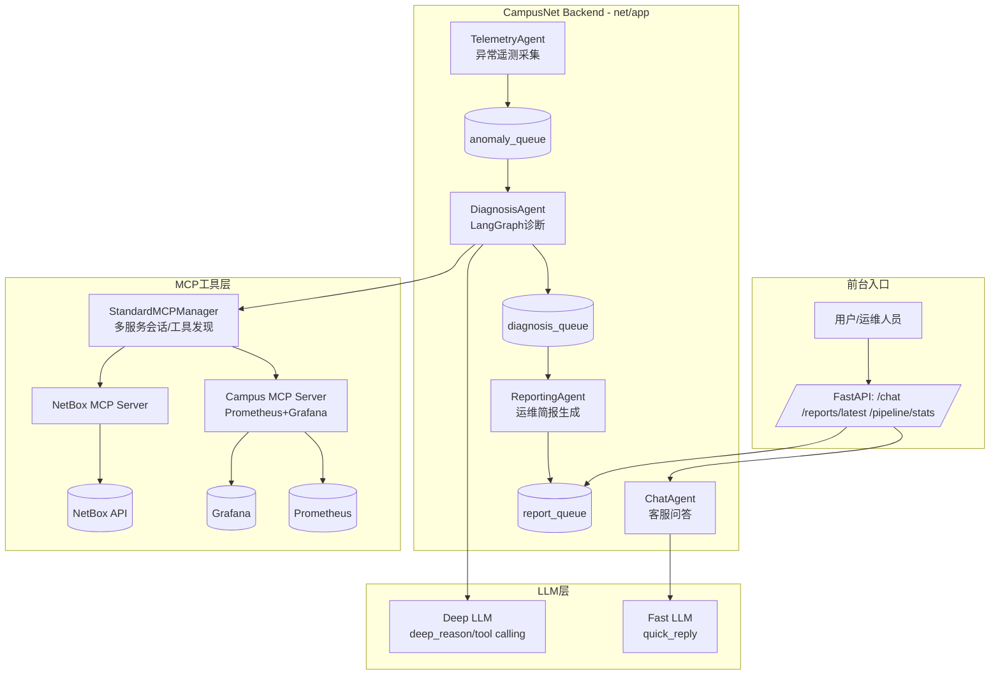
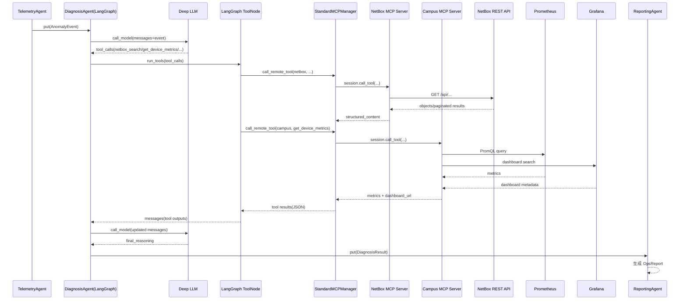

# CampusNet Backend 架构分析与实现说明

## 1. 项目总体定位

该仓库包含两部分：

- `net/`: CampusNet Copilot 业务后端（FastAPI + 多智能体 + LangGraph + MCP 客户端）。
- `netbox-mcp-server/`: NetBox 官方风格 MCP Server（向上暴露 NetBox 检索/查询工具）。

核心目标是把校园网运维流程拆成“宏观异步流水线 + 微观智能诊断图”：

- 宏观（Macro-Async）：异常发现 -> 诊断 -> 报告，使用 `asyncio.Queue` 解耦。
- 微观（Micro-LangGraph）：在诊断阶段用 LangGraph 驱动“LLM 推理 <-> 工具调用”的迭代闭环。

## 2. 系统整体架构（核心图）



## 3. 关键分层与职责

### 3.1 API 与任务编排层

- 应用入口：`net/app/app.py`
- 在 FastAPI `lifespan` 中启动 3 个后台任务：`TelemetryAgent`、`DiagnosisAgent`、`ReportingAgent`。
- `ChatAgent` 走独立低延迟链路，不进入诊断队列，避免与重诊断任务竞争。

### 3.2 智能体流水线层

- `TelemetryAgent` 周期产生异常事件（丢包阈值触发）。
- `DiagnosisAgent` 从 `anomaly_queue` 拉取事件，驱动 LangGraph 执行多步诊断。
- `ReportingAgent` 把诊断结果重写为结构化运维简报并写入 `report_queue`。

### 3.3 工具与外部系统层

- `StandardMCPManager` 统一管理多个 MCP Server 连接与工具调用。
- Campus MCP（自建）提供监控维度工具：
  - `get_device_metrics`（Prometheus）
  - `get_dashboard_url`（Grafana）
- NetBox MCP（独立项目）提供 CMDB/拓扑查询：
  - `netbox_get_objects`
  - `netbox_get_object_by_id`
  - `netbox_search_objects`

## 4. LangGraph 工作流设计：如何拆解复杂运维任务

### 4.1 图结构

诊断图在 `net/app/agent/graph.py` 中构建，节点与边为：

- `START -> call_model`
- `call_model -> tool_node`（当 LLM 输出 `tool_calls`）
- `tool_node -> call_model`（工具结果回注后继续推理）
- `call_model -> END`（当模型直接输出结论）
- `call_model -> force_finalize`（触发熔断）
- `force_finalize -> END`

### 4.2 状态模型

`AgentState`（`net/app/agent/state.py`）包含：

- `messages`: 对话、工具调用、工具返回的统一消息总线（`add_messages` 聚合）。
- `event_id/location/issue_desc`: 诊断上下文锚点。

### 4.3 复杂任务拆解策略（运维视角）

一次复杂运维诊断被拆为“可迭代证据收集循环”：

1. 任务初始化：将异常事件和诊断约束（必须同时看拓扑与监控）写入首条 `HumanMessage`。
2. 模型规划：`call_model` 判断下一步需要哪些工具和参数。
3. 工具并行/串行执行：`tool_node` 调 MCP 工具抓取 NetBox 拓扑、Prometheus 指标、Grafana 看板线索。
4. 证据回注再推理：工具结果写回 `messages`，模型继续缩小根因范围。
5. 收敛输出：当证据充分时直接结束；若出现重复调用或超轮次，进入 `force_finalize` 强制收敛。

### 4.4 抗失控机制

- 最大工具轮次限制（`max_tool_turns=30`）。
- 连续两轮 `tool_calls` 签名一致时判定循环，触发 `force_finalize`。
- 若某轮工具全部失败，在消息中注入“停止调用工具并给人工排查建议”的指令。

## 5. MCP 接入 NetBox 等工具：代码逻辑

### 5.1 连接与发现（StandardMCPManager）

实现文件：`net/app/mcp/client.py`

1. 读取配置生成端点：`netbox`、`campus`。
2. `connect()` 优先走 SSE（`/sse`），失败后自动降级到 streamable-http（`/mcp`）。
3. `list_remote_tools()` 对每个会话分页拉取工具定义（名称、描述、JSON Schema）。
4. `call_remote_tool()` 统一封装调用结果：
   - `ok`
   - `structured_content`
   - `content`（原始文本片段）

### 5.2 动态工具封装（Hybrid MCP Tools）

实现文件：`net/app/agent/tools.py`

`build_hybrid_mcp_tools()` 的核心逻辑：

1. 远程发现工具后，按输入 JSON Schema 动态生成 Pydantic 参数模型。
2. 将每个远程工具包装为 LangChain `StructuredTool`，可被 `llm.bind_tools()` 直接使用。
3. 执行前做参数归一化与类型纠偏（字符串转 int/float/bool/list/dict）。
4. 执行后统一把结果序列化为 JSON 字符串返回给 LangGraph。

### 5.3 NetBox 特殊容错链

该项目对 NetBox 做了多级兜底，避免诊断链因单点异常中断：

- `netbox_search_objects` 失败/空结果时：
  - 自动回退到 `netbox_get_objects`（精确 `name`）
  - 再尝试带 `fields`
  - 再尝试模糊 `name__ic`
  - 仍失败则直连 NetBox REST API（绕过 netbox-mcp-server）
- `netbox_get_objects` 失败时：直连 NetBox REST 查询。
- `netbox_get_object_by_id` 失败时：直连 NetBox REST 单对象查询。
- 对 `dcim.interface` 会剔除高风险字段（如 `connected_endpoints`）以规避某些版本 502。

## 6. 调用时序图（MCP + NetBox + 监控）



## 7. Quick Start

- 安装依赖

  ```python
  uv pip install requirement.txt
  ```

- docker拉取Netbox等工具

  ```python
  docker-compose up -d
  ```

- 启动Netbox-mcp-server

  ```
  cd netbox-mcp-server
  uv run netbox-mcp-server
  ```

- 启动Campus-mcp-server

  ```
  cd net
  uv run scripts/run_mcp_server.py
  ```

- 启动后端

  ```
  uv run scripts/run_backend.py
  ```

- (测试DiagnosisAgent)

  ```
  uv run scripts/test_diagnosis_agent_behavior.py
  ```

- 测试TelemetryAgent + DiagnosisAgent + ReportingAgent

  ```
  uv run scripts/run_agent_demo.py
  ```

  

## 8. 注意

- TelemetryAgent当前是固定时间生成故障数据（假数据）送往AnomalyQueue,需要修改成周期性监测外部设备的真实数据，达到某一指标后（eg：pocketloss >=20%)再生成AnomalyEvent进行诊断。

- netbox_test.py是向NetBox中输入的进行测试的假数据（图书馆三层网络设备）：

  

向Prometheus注入的数据如下：

```python
cat <<EOF | curl --data-binary @- http://localhost:9091/metrics/job/campusnet
device_connections{device_id="AP-LIB-3F-01"} 120
device_cpu_load{device_id="AP-LIB-3F-01"} 0.45
device_packet_loss{device_id="AP-LIB-3F-01"} 0.02
device_connections{device_id="AP-LIB-3F-02"} 260
device_cpu_load{device_id="AP-LIB-3F-02"} 0.82
device_packet_loss{device_id="AP-LIB-3F-02"} 0.09
EOF
```

启动test_diagnosis_agent_behavior.py后的测试结果:

```css
"final_reasoning": "### 校园网络故障诊断报告  \n**事件ID**: evt-integration-001  \n**地点**: 图书馆 三层  \n**故障现象**: 网络掉线伴随高丢包  \n**可疑设备**: AP-LIB-3F-02  \n\n---\n\n### 1. **并行执行初始诊断任务**  \n#### **任务1：NetBox物理拓扑与关联信息**  \n通过搜索设备名称 `AP-LIB-3F-02`，获取以下 信息：  \n- **设备ID**: 456  \n- **站点**: 图书馆（ID: 10）  \n- **状态**: 活跃（active）  \n- **角色**: 无线接入点（Wireless AP）  \n- **关联接口**:  \n  - 接口 `eth0`（ID: 789）连接至交换机 **SW-LIB-3F-01**（ID: 101）的接口 `Gi0/1`（ID: 202）。  \n\n#### **任务2：实时运行指标（Campus工具）**  \n查询设备 **AP-LIB-3F-02（ID: 456）** 的实时指标：  \n```json\n{\n  \"456\": {\n    \"connections\": 150,        // 当前连接数\n    \"cpu_load\": 95,            // CPU负载（95%）\n    \"packet_loss\": 65          
// 丢包率（65%）\n  }\n}\n```  \n**关键发现**:  \n- **极高丢包率（65%）** 与 **CPU过载（95%）**，表明 设备自身可能过载或硬件故障。  \n- 连接数（150）在正常范围内，排除突发流量冲击。  \n\n---\n\n### 2. ** 拓扑关联分析**  \n通过接口 `eth0` 的上行链路追踪至交换机 **SW-LIB-3F-01（ID: 101）**，进一步查询其指标：  \n```json\n{\n  \"101\": {\n    \"connections\": 500,        // 交换机总连接数\n    \"cpu_load\": 30,            // CPU负载（30%）\n    \"packet_loss\": 5           // 丢包率（5%）\n  }\n}\n```  \n** 关键发现**:  \n- 交换机整体运行正常（丢包率5%，CPU负载30%），但需进一步检查其接口 `Gi0/1` 的状态。  \n\n---\n\n### 3. **故障根因推断**  \n1. **AP自身故障可能性高**:  \n   - 高丢包率（65%）与高CPU负载（95%）直接关联，可能由以下原因导致：  \n     - 硬件故障（如射频模块过热）。  \n     - 固件缺陷或配置错误（如信道干扰、功率过载）。  \n     - 遭受无线攻击（如泛洪攻击）。  \n\n2. **上行链路问题可能性低**:  \n   - 交换机整体指标正常，但需确认接口 `Gi0/1` 的物理状态（如光模块故障、网线松动）。  \n\n---\n\n### 4. **建议行动**  \n1. **紧急处理**:  \n   - 重启 **AP-LIB-3F-02**，观察指标是否恢复。  \n   - 检查交换机接口 `Gi0/1` 的物理连接（网线/光模块）。  \n\n2. **深度排查**:  \n   - 通过 **Grafana仪表盘**（调用 `get_dashboard_url` 获取链接）查看历史指标趋势。  \n   - 检查AP的无线客户端分布，确认是否存在异常终端占 用资源。  \n\n3. **长期优化**:  \n   - 若问题复现，更换AP硬件或升级固件。  \n   - 优化无线信道规划，减少同频干扰。  \n\n---\n\n**下一步工具调用建议**:  \n- 调用 `get_dashboard_url(device_name='AP-LIB-3F-02')` 获取监控面板链接。  \n- 查询交换机接口 `Gi0/1` 的详细状态（需补充接口级指标工具）。  \n\n> **注**: 当前诊断基于设备级指标，若问题持续，需结合无线频谱分析进一步定位。"
}
```

